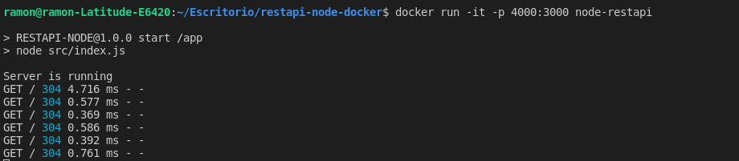
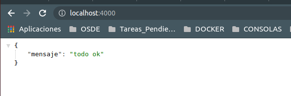
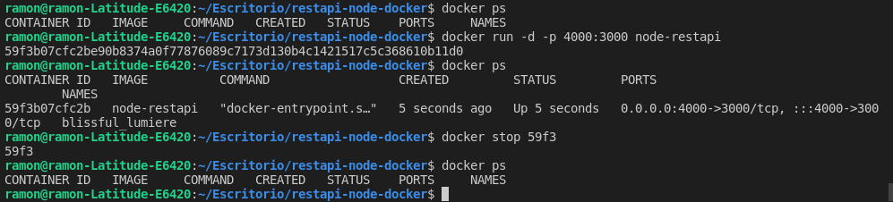

# restapi-node-docker
Ejemplo básico del uso de docker y node. Ejemplo de Fazt Code: https://www.youtube.com/watch?v=iLlmm0L-VpQ   

---

---
Hay que matar el proceso cuando corremos la app con el siguiente comando
**$ docker run -d -p 4000:3000 node-restapi**

